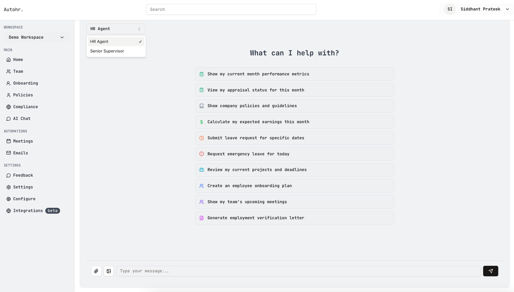
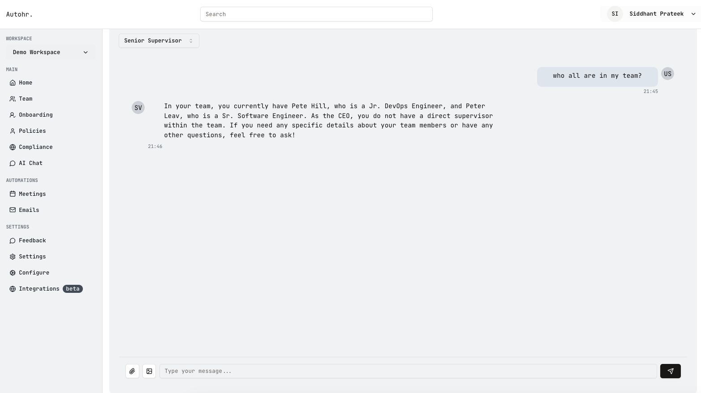
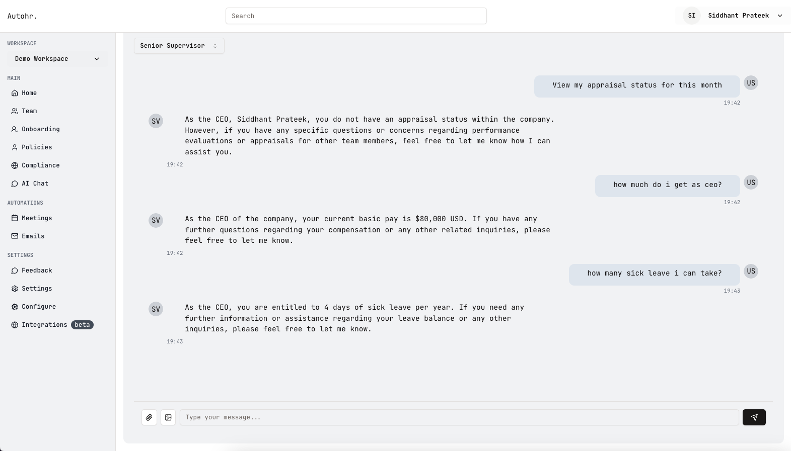

# Autohr


> _Note: The application is currently not "live" due to pending security implementations in the backend. Deploying at this stage could expose the system to vulnerabilities such as DDoS attacks and SQL injections. Addressing these concerns is a priority for ensuring a safe and stable deployment environment._

## Inspiration

We all must have heard of these stories on Reddit or on X.
```
Just got laid off by someone who I've never met in my 3 years at BigTech™. Random HR person jumped on a call, said "performance issues" with zero data to back it up. Cool cool cool.
@random
```
```
My dad's in the ICU and getting emergency leave approved is literally harder than fixing prod issues at 3am. HR ghosted my Slack messages for 8 hours. What's even the point?
@random
```
```
Day 187 of trying to get my health insurance updated:
✅ Built entire microservice
✅ Deployed to production
✅ Merged 43 PRs
❌ Still waiting for HR to process my form
@random
```

The inspiration for "Autohr" came from the widespread frustration with traditional HR processes, prominently voiced across platforms like Reddit. I observed recurring patterns:
- Employees feeling disconnected from HR representatives they barely know
- Lack of transparency in performance metrics during layoffs
- HR ghosting during urgent family emergencies
- Awkward and infrequent conversations leading to communication barriers
- Remote jobs and SMEs often lacking dedicated HR support
- Technical teams being interrupted from complex problem-solving for basic HR tasks

These pain points revealed a clear truth: the traditional HR role needs reimagining for the modern workplace. Rather than eliminating HR, I saw an opportunity to automate routine tasks while making human intervention more meaningful and data-driven. Autohr aims to bridge this gap by providing an always-available, metric-driven HR interface that respects both employee time and human complexity.

## Tech Stack and Tools

- Frontend: React (Vite), Tailwind, DaisyUi, Shadcn 
- Authentication: Supabase
- Langchain
- Database: Mongodb
- Vector Db: Mongodb Atlas Vector Search, Qdrant
- Backend: Express / Node.js

## Preview (Screenshots)






## Challenges I ran into
1. Understanding and implementing broader memory context for conversations was technically challenging, requiring deep dives into LLM architecture and prompt engineering.

2. Balancing development time between concurrent projects while maintaining code quality and meeting deadlines.

3. Balancing search accuracy with response time required careful tuning of our vector search implementations.


## Accomplishments that I'm proud of
- Designed and implemented a complete UI dashboard from scratch
- Achieved vector database integration for efficient knowledge retrieval
- Rapidly acquired and applied GenAI knowledge, going from basic understanding to a functional product in weeks


## What's next for Autohr.dev
1. **Advanced Analytics**
   - Generate comprehensive company analytical reports
   - Implement performance metric tracking and visualization
   - Create predictive models for employee success

2. **Employee Development**
   - Identify and support lower-performing employees with targeted knowledge modules
   - Provide detailed performance metrics with improvement suggestions
   - Create personalized development paths

3. **Enhanced Automation**
   - Develop text2sql capabilities with proper permission handling for:
     * Information updates
     * Vacation/sick leave query management
     * Expense report processing
     * a lot more...
   - Implement security checks and privilege verification before database queries

4. **Provider Integration**
   - Add support for multiple AI providers:
     * Anthropic
     * Grok
     * Gemini
     * Ollama
     * Custom Models
   - Test and optimize Qdrant integration

5. **Workspace Integration**
   - Implement Slack, Discord and other communication channel integration.

6. **Security and Compliance**
   - Implement permission systems
   - Ensure data privacy compliance


## Local Development

> Rename the `.env.sample` to `.env`

```bash
docker compose up -d
docker compose -f docker-compose.memgpt.yml up -d

# api server
cd api; npm install

# frontend
cd frontend; bun install
```

<!-- https://supabase.com/docs/reference/python/auth-admin-inviteuserbyemail
https://supabase.com/docs/reference/python/auth-admin-generatelink -->

<!-- Langchain -->
## Resources
- https://langchain-ai.github.io/langgraphjs/
- https://js.langchain.com/docs/integrations/chat/openai/
- https://js.langchain.com/docs/integrations/vectorstores/mongodb_atlas/
- https://js.langchain.com/docs/integrations/vectorstores/
