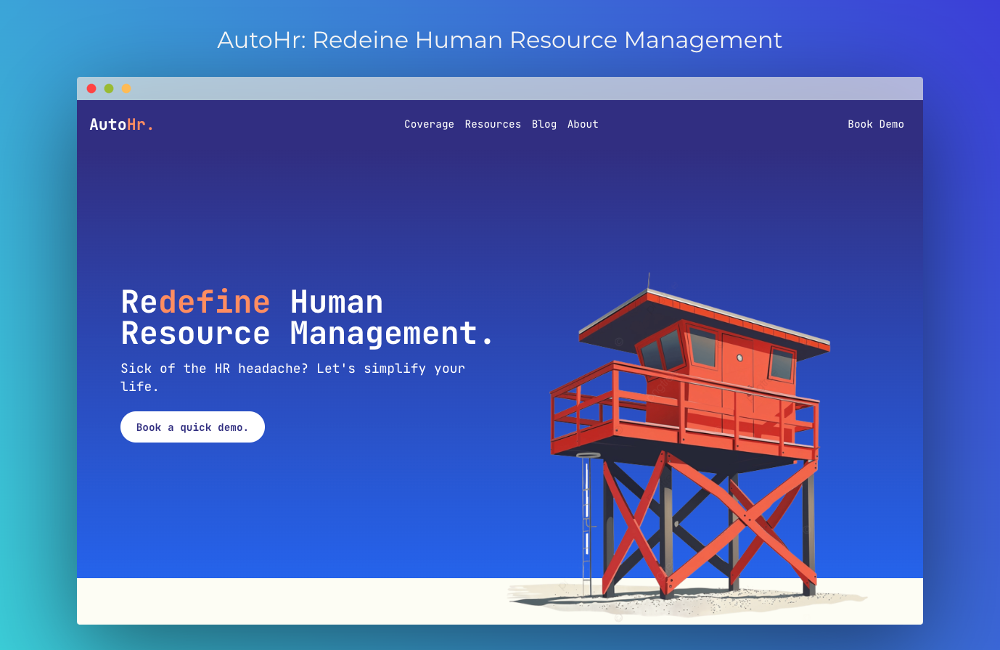

# Autohr

## Tech Stack and Tools

- Frontend: React (Vite), Tailwind, DaisyUi, Shadcn 
- Authentication: Supabase
- Langchain
- Database: Mongodb
- Vector Db: Mongodb Atlas Vector DB, Qdrant
- Backend: Express / Node.js