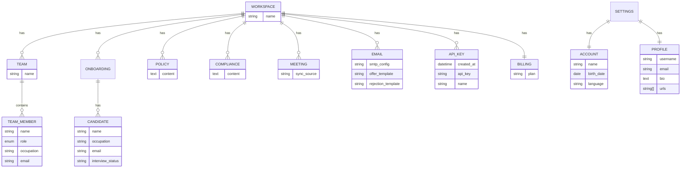

## DB Structure

```mermaid
erDiagram
    WORKSPACE ||--o{ TEAM : has
    WORKSPACE ||--o{ ONBOARDING : has
    WORKSPACE ||--o{ POLICY : has
    WORKSPACE ||--o{ COMPLIANCE : has
    WORKSPACE ||--o{ MEETING : has
    WORKSPACE ||--o{ EMAIL : has
    WORKSPACE ||--o{ API_KEY : has
    WORKSPACE ||--|| BILLING : has
    WORKSPACE {
        string name
    }
    TEAM ||--o{ TEAM_MEMBER : contains
    TEAM {
        string name
    }
    TEAM_MEMBER {
        string name
        enum role
        string occupation
        string email
    }
    ONBOARDING ||--o{ CANDIDATE : has
    CANDIDATE {
        string name
        string occupation
        string email
        string interview_status
    }
    POLICY {
        text content
    }
    COMPLIANCE {
        text content
    }
    MEETING {
        string sync_source
    }
    EMAIL {
        string smtp_config
        string offer_template
        string rejection_template
    }
    API_KEY {
        datetime created_at
        string api_key
        string name
    }
    BILLING {
        string plan
    }
    SETTINGS ||--|| ACCOUNT : has
    SETTINGS ||--|| PROFILE : has
    ACCOUNT {
        string name
        date birth_date
        string language
    }
    PROFILE {
        string username
        string email
        text bio
        string[] urls
    }
```